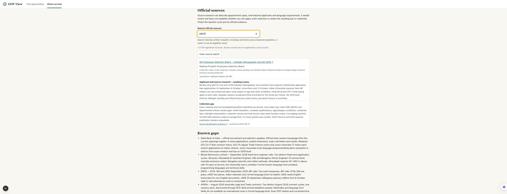

# Phase 68 — Madhya Pradesh police Steno/ASI source

Local date: 27 September 2026, Asia/Kolkata. Exact original fetch receipts retain their UTC timestamps. This phase advances Indian recruitment coverage; the worldwide goal remains incomplete.

## Added development

- Registered `in-mp-esb-steno-asi-2026` and its `mpesb-steno-asi-2026` collector, disabled and review-required.
- Original home page, dashboard, MPOnline form register and 2,314,726-byte Hindi rulebook are retained with URL, content type, time and SHA-256. PDF hash: `0af335cfde1efd8e339d1dab7c29c68127152d987d59cea35494ce9ce12b6f8c`.
- Collector binds the complete matching notice section, current application service and exact PDF bytes before reusing extraction. Unexpected amendments, changed dates, redirected documents and forged receipts fail closed.
- One joint application covers Subedar (Ministerial Stenographer) and ASI (Ministerial), using post preferences. Roles, cadres and vacancy seats do not multiply application cycles. Historical 2025 results remain separate.
- Source directory exposes appointment uncertainty, nationality, non-MP route and Hindi skills. `CPCT` finds one of India's 99 registered sources. Research is visibly awaiting review.

Registry: **183 sources, 99 India, 70/250 jurisdictions with a registered source**. **180 jurisdictions have none**. Source presence is not complete authority coverage or verified opportunity publication. India's existing primary-commission and other-employer gaps remain unresolved.

## Official evidence and applicant conditions

Primary sources: [MPESB home](https://esb.mp.gov.in/home_n.html), [dashboard](https://esb.mp.gov.in/student_dashboard.htm), [MPOnline register](https://esb.mponline.gov.in/Portal/Examinations/Vyapam/examsList.aspx), [2026 rulebook](https://esb.mp.gov.in/Rulebooks/RB_2026/Steno_ASI_2026_Rulebook_17092026.pdf).

| Field | Evidence and interpretation |
| --- | --- |
| Application window | 24 September–8 October 2026 in original first page and both registers. Corrections end 13 October; that does not extend new applications. |
| Cutoff | Page 29, §2.17(i), says midnight on the final date. Official timezone and midnight interpretation need review; no `23:59`, `24:00` or next-day instant is invented. Status stays uncertain around the date boundary. |
| International applicants | Page 6, §3(i), explicitly requires Indian citizenship. A foreign citizen fails that criterion for this intake. It does not establish every Indian public job's rules. |
| Non-MP Indian applicants | Page 9 permits unreserved open vacancies, without reservation or age-relaxation benefits and with maximum age 33 on 8 October. MP domicile is not a universal exclusion rule. |
| Qualifications | Higher-secondary/10+2, CPCT with Hindi typing and prescribed recognized computer-qualification routes. Specific equivalences and certificates need human review. |
| Hindi requirements | Page 13 gives Hindi MCQ medium. Page 9 requires CPCT with Hindi typing for both roles; Subedar additionally needs a recognized Hindi shorthand qualification at 100 words per minute. These skills/certificates are distinct from CEFR proficiency. |
| Government employees | Prior appointing-authority permission belongs at examination entry under page 7, §3(iv). Accepted resignation/release belongs at later appointment. |
| Job type | Direct recruitment and Class III classification are stated; permanent tenure is unverified. Minimum service before transfer does not become a five-year contract. |
| Venues | Hiring jurisdiction, possible test cities and work units do not establish an assigned applicant venue. Venue remains unknown. |

Full rules remain incomplete. Indian citizenship cannot override missing education, certificates, age, residence/category, skill, medical or appointment conditions. Deterministic checks reject nationality/education mismatches; otherwise incomplete evidence requires verification. Application, selection entry and appointment remain separate assessments.

Pages 6, 8, 9, 12, 13 and 29 were visually checked against saved renderings. Derived PDF text has missing Hindi glyphs; original pages remain authoritative. Translation/extraction awaits founder review. No candidate names or personal identity submissions are collected.

## Collection and storage result

Live `npm run collect -- --source in-mp-esb-steno-asi-2026 --stage` stopped with:

> Retained evidence storage budget reached; previous records preserved

Exit code **1**. Measured evidence store: **871,622,022 bytes**; configured cap: **838,860,800 bytes (800 MiB)**; excess: **32,761,222 bytes**. Cap remains unchanged. No new review packet or published cycle was created. Collector health records the actual failure with successful fetch and validation timestamps still null.

Write-free live collection then succeeded, returning **one candidate, zero approved, zero kept**. The original PDF hash matched and all three live page checks passed. [Candidate preview](phase-68-2026-09-27-candidate-preview.json) was generated from retained originals outside the publication queue. It is neither a queued review decision nor an approved record.

Queue remains **328 drafts across 82 packets**, with **zero measured human decisions and zero approved/public listings**. Stored collected records remain **18,760**, a separate denominator. India's health history did not gain a successful collector check from research or dry-run receipts.

The failed staged run recomputed coverage globally. Existing 69 non-India rows were restored; India retains its previous fields plus the new source's explicit gap. Existing health entries and all previous review packets remain unchanged. Verification records that preservation.

## Checks and review

- Four test-first connector tests pass, including extra single/unquoted amendments, amendments outside the date row, correction-only forms, changed PDF bytes, forged receipts, eligibility and timezone boundaries.
- Full `npm test`: **358 passed, zero failed**.
- `npm run typecheck`: **passed**. First attempt incorrectly compiled a saved source snapshot in `phases/`; it was renamed to `.ts.txt`, and the successful rerun is saved alongside the original failure log.
- Spec review found examination permission assigned too late; fixed and regression-checked. Standards review found two amendment-detection gaps; both fixed and regression-checked. Follow-up reviews cleared these findings. Review scope is this phase, not a worldwide audit.
- Public-data generation remains **zero records across zero countries**.
- Browser check confirms 99 India sources, one CPCT match, review-only language and visible staging failure.

Originals, receipts, extraction metadata, collector/test code, before-state snapshot, scoped diff, review findings, test/build logs, metrics, storage receipt, preview, browser state/screenshot, final verification and artifact manifest are saved in the project folder.

## Remaining work

Resolve evidence-store pressure while preserving originals and review provenance before further staged collection. Then rerun this disabled source, review its full Hindi criteria and record a real human decision. No connector acceptance or automated publication is claimed. Haryana HPSC and MPPSC automated archive access still require permitted routes; other authorities and all four worldwide pathways remain incomplete. Worldwide audit and the separate 18,000-file production-export gate remain outstanding.
