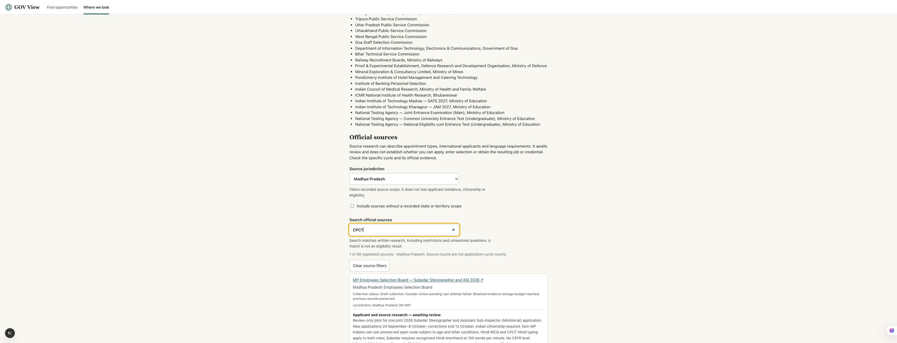

# Phase 69 — State source filters and evidence capacity

Local date: 27 September 2026, Asia/Kolkata. This phase improves source discovery while collection awaits a storage decision. The worldwide goal remains incomplete.

## Applicant development

The India source directory now has an exact jurisdiction selector containing all 28 states and eight union territories. State cards in the worldwide directory link to that filtered source view. United States coverage uses the existing state/territory inventory. Other countries retain their full source directory and research search.

Scope filtering uses recorded jurisdiction codes, not state names mentioned in nationality or residence research. Sources without a recorded state or territory scope are excluded when a state is selected, with an explicit opt-in checkbox. An absent scope is not claimed to mean nationwide hiring or eligibility.

Text search still finds appointment types, international-applicant research and language requirements. Its visible warning explains that matches include restrictions and unresolved questions. Filter results are sources, not distinct application cycles or an eligibility assessment.

Shared URLs contain only `sourceQuery`, `state` and `unscoped`. Parsing ignores private/profile fields, validates state codes against the country's inventory and limits search text to 200 characters. Reload and browser Back restore public filter state after hydration. Clear restores the full directory. Native labeled controls and the result status remain keyboard accessible.

## Browser evidence

| View | Sources shown |
| --- | ---: |
| All India | 99 |
| Madhya Pradesh | 3 |
| Madhya Pradesh + CPCT | 1 |
| Punjab + CPCT | 0 |
| Punjab | 3 |
| Punjab including unscoped sources | 29 |
| California | 1 of five US sources |

Punjab reload, browser Back to India and clearing filters were checked. The initial static page lists all country sources before client hydration restores URL filters. The final screenshot shows the selected Madhya Pradesh scope, CPCT query, one matching source and its review/storage status.

## Evidence-storage investigation

The collector's existing logical evidence cap remains **838,860,800 bytes (800 MiB)**. Initial measurement found **871,622,022 bytes**, exceeding it by **32,761,222 bytes**. The local filesystem reported 97% usage with about 5.8 GiB available. These are local filesystem and directory measurements, not iCloud or hosting quotas.

The read-only audit inventories exact bytes and SHA-256 values, groups byte-identical files, verifies retained collector body hashes, and estimates gzip size for text. No original, receipt, review record or path is deleted, relocated, overwritten or excluded from the cap. Duplicated bytes cannot justify deleting source URLs, receipt histories or review provenance. Moving files outside the measured directory alone would not resolve storage policy.

The whole-store audit began with its initial worker, which loaded complete files into memory. Review identified that risk. The saved worker now hashes/compresses in 1 MiB chunks and stops gzip verification above 128 MiB decoded content. Four fixture checks verify raw hashes, gzip original hashes, wrong body names and oversized decompression rejection. The measurement receipt and review record distinguish the initial audit runtime from the updated worker checks.

The first whole-store audit rejected its snapshot because metadata changed during the scan; it did not emit complete totals. A second audit uses the streaming worker and records changed paths or unread files as an incomplete snapshot. The second process finished with exit 0, but its snapshot was incomplete: 2,353 files read, two bounded-read failures, and no metadata changes. Both failed paths were then read successfully. A separate reconciliation checks every current path, size and modification time against its successful read: all 2,355 files match, totaling 871,622,022 bytes. The original incomplete audit remains unchanged. Reconciled exact duplicate redundancy is 223,389,648 bytes; text totals 80,884,229 bytes with estimated gzip size 18,846,497 bytes. All 617 collector bodies checked match their hash filenames. These are logical-byte measurements and estimates, not physical savings or permission to discard provenance.

## Concrete storage choices

| Option | Preparation and safeguards | Limitation |
| --- | --- | --- |
| Capped 1 GiB local pilot | Explicit cap change, regression checks below/above the new limit, disk-space check, then rerun only the disabled MPESB source. Preserve originals and previous review packets; verify body hashes and create a genuine pending packet. | Approximately 193 MiB initial headroom before new evidence. This is pilot capacity, not worldwide operating capacity. |
| S3-compatible evidence migration | First select a zero-cost-compatible storage arrangement. Retain objects by original SHA-256 and preserve separate URL/time/translation/review receipts. Verify every uploaded byte and read-back before changing references. Keep local originals through rollback validation. Enforce object-byte and request budgets. | Infrastructure, free quotas, repository/CI compatibility and operating costs need research. No provider, subscription or deployment is selected. |

The user's storage preference is pending. No cap increase, migration or collection retry is implied by the preselected answer. Neither option approves an applicant record. The existing two-hour weekly founder review capacity and measured-review gate remain relevant before increasing collection volume.

## Verification and remaining scope

Four new filter tests pass. Full `npm test`: **362 passed, zero failed**, exit 0. `npm run typecheck`: **passed**, exit 0. Both original processes finished; no observation timeout caused a restart. Spec review found no actionable issue. Standards review's audit memory finding was fixed and cleared. Four updated audit-worker checks also pass. The original incomplete snapshot and successful supplemental reconciliation are saved separately. Storage preference remains pending.

Registry remains **183 sources, 99 India, 70/250 jurisdictions with a source**. Remaining 180 jurisdictions and authority-level gaps remain incomplete. Queue remains **328 drafts in 82 packets**, with no approved or public listings. This phase makes no approval, publication, connector-acceptance or worldwide-coverage claim.

Source/review state preservation, browser receipts, audit findings, code diff and final artifact hashes are saved in this folder. No commit, push or deployment is performed.
