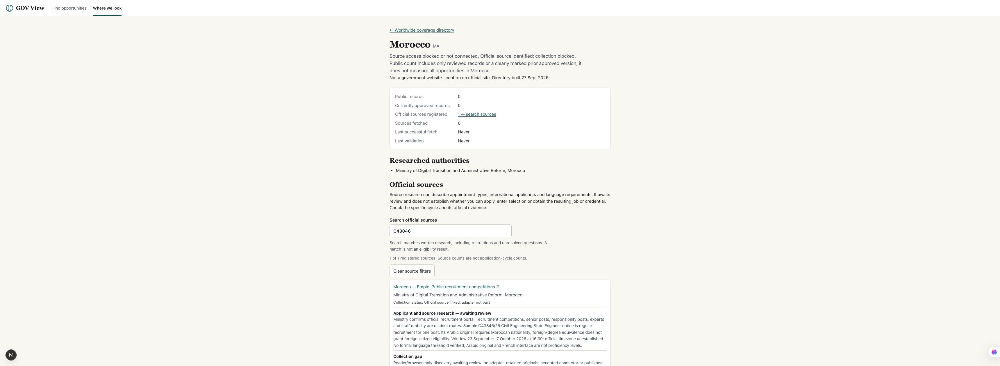

# Phase 79 — Türkiye, Morocco and Tunisia official recruitment sources

27 September 2026. Three previously missing jurisdictions gain official recruitment source links and visible applicant research. This is directory discovery awaiting review, with no new application cycles, human approvals or public listings.

## Official evidence

| Jurisdiction | Source | Applicant interpretation |
| --- | --- | --- |
| Türkiye | [Kariyer Kapısı](https://kariyerkapisi.gov.tr/isealim), identified by its Presidency footer | Current reader shows search controls and table headings; it does not establish a complete or empty notice inventory. Appointment type, international eligibility and language level need employer notices. Turkish interface is not a proficiency criterion. [FAQ](https://kariyerkapisi.gov.tr/sss) requests failed this phase; earlier Phase 78 observations remain separately dated. |
| Morocco | [Emploi Public](https://www.emploi-public.ma/fr/concours-liste), [identified by the ministry](https://www.mmsp.gov.ma/fr/nos-services/portail-de-l%E2%80%99emploi-public) | Recruitment, senior posts, experts and staff mobility remain distinct routes. Sample [C43846/26](https://www.emploi-public.ma/fr/concours/details/bd7d21e6-ce27-4590-9ae0-ba4755897c51) is regular recruitment for one Civil Engineering State Engineer. Its [Arabic original](https://www.emploi-public.ma/fr/concours/download/arrete/bd7d21e6-ce27-4590-9ae0-ba4755897c51) requires Moroccan nationality; foreign-degree equivalence does not grant foreign-citizen eligibility. This restriction belongs to this competition only. Window 23 September–7 October at 16:30, with timezone unestablished. Permanent tenure and formal language level remain unverified. |
| Tunisia | [National Public Recruitment Competition Portal](https://www.concours.gov.tn/) | Portal combines recruitment news and selection results. Sample [Hammamet news](https://www.concours.gov.tn/P1/index31.aspx?id=325), dated 25 September, describes temporary category A1 civil-engineer recruitment. Original opening/organization decisions and complete rules remain unreviewed. National-ID login does not establish foreign eligibility; Arabic interface does not establish proficiency. Unverified non-government domain spelling printed in the news is not adopted as an application link. |

Morocco original was read as text and visually on all three pages in the ordinary browser. Web screenshot requests failed; browser navigation initially timed out, then the same tab rendered the document. No external original, DOM dump or screenshot was saved. No hash acceptance or fresh collector timestamp is claimed. Tunisia introduction request returned initially but later timed out; its failure does not imply cancellation or no current jobs.

Egypt [CAOA portal](https://jobs.caoa.gov.eg/) remains an unregistered discovery lead after another failed reader request. No current page, closure or checked-empty state was accepted.

## Authoritative changes

- Registry: 210 → 213 sources; three new entries use `connector: none`, `enabled: false`, `reviewRequired: true`.
- Source presence: 94 → 97 of 250 inventory jurisdictions; 153 have no registered source. These counts do not prove complete authority or pathway coverage.
- India remains 99 sources across all 36 state/UT discovery scopes; Japan remains 10 sources and US-country remains five. Separately administered territories retain their own inventory accounting.
- Three new coverage rows have zero connected sources, no verified listings, explicit gaps and null successful-fetch/validation timestamps. Existing 94 rows and 210 sources remain unchanged.
- Queue remains 328 drafts in 82 packets; zero human approvals and public listings. All three eligibility stages remain “needs verification” in the research matrix; sample restrictions are evidence summaries, not personalized results.

## Verification and remaining work

All six focused tests and public-data build passed. Local browser checks passed for all three country sources, scoped sample rules and restored public Morocco search. Actual process and preservation outcomes are recorded in the process results and final receipt. Phase 78 already passed all 364 tests and typecheck; application runtime and its corrected connectors are unchanged this phase. Full suite and production build are not rerun for directory-only additions.

Verifier checks append-only registry/coverage changes, 83 preserved health/review files, unchanged runtime, evidence accounting, pending queue, public export and applicant uncertainty. Browser checks cover each new country’s source, official links, review warning, unknown freshness and search/share restoration.

Evidence remains 2,355 files / 871,622,022 logical bytes, above the unchanged 800 MiB collector cap. No originals added, deleted, moved or compressed. Collection remains paused pending the unanswered storage choice. Founder decisions, permission checks, exact notice evidence, accepted translations/connector outputs, full authority reconciliation and independent worldwide audit remain outstanding. The prior production export remains 18,383 files versus an 18,000-file gate. No deployment.

## Saved artifacts

- [Research matrix](../data/discovery/turkiye-morocco-tunisia-recruitment-2026-09-27.json)
- [Registry additions](phase-79-2026-09-27-source-config.json)
- [Browser checks](phase-79-2026-09-27-browser-checks.json)
- [Verification receipt](phase-79-2026-09-27-verification.json)
- [Artifact manifest](phase-79-2026-09-27-artifact-manifest.json)
- [Process results](phase-79-2026-09-27-process-results.json)

